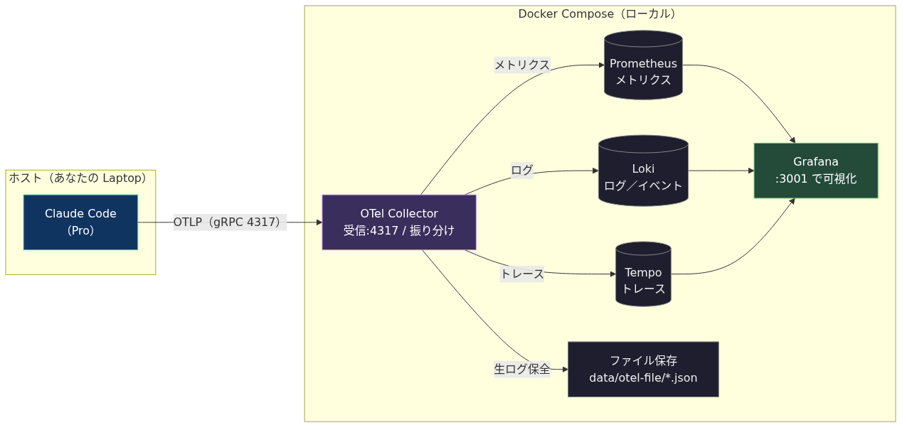
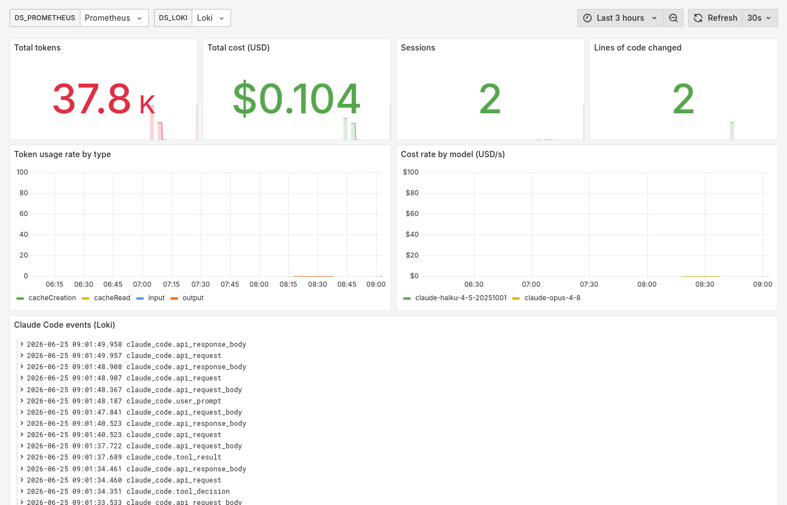
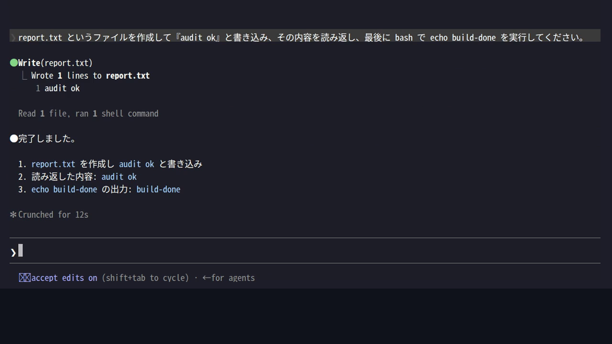
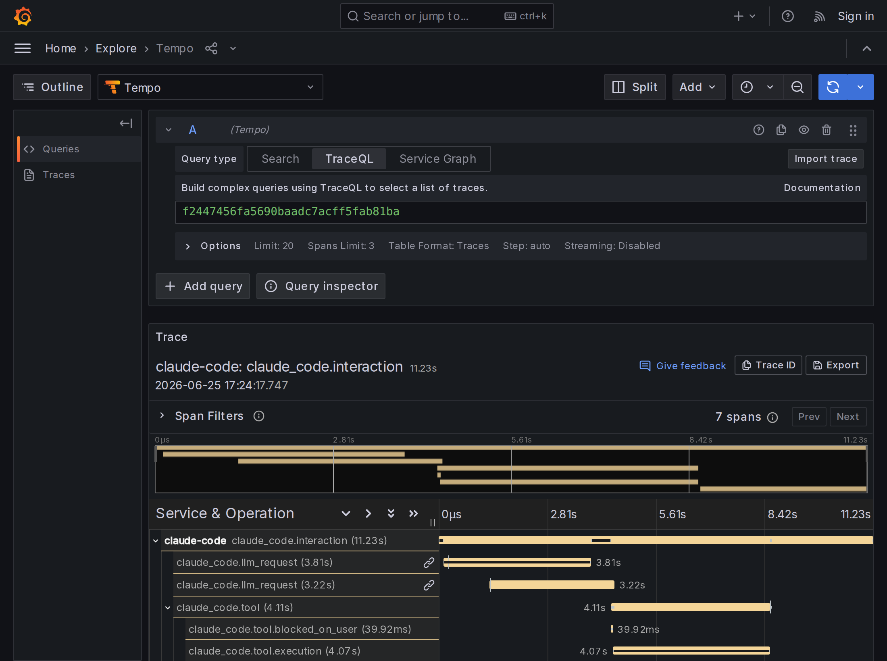

<!-- _paginate: false -->
<!-- _header: '' -->
<!-- _footer: '' -->

<div class="eyebrow">技術検証レポート</div>

# OpenTelemetry を活用した<br>Claude Code の Observability 検証

<span class="small">検証日: 2026-06-25 ／ 対象: Claude Code v2.1.179</span>

> **まとめ**
> - **構成**: OpenTelemetry (OTel) Collector / Prometheus / Loki / Tempo / Grafana
> - **取得できる**: ユーザ入力本文・モデル出力本文・ツール入出力・分散トレース
> - **取得できない**: 拡張思考 (extended thinking) 本文

---

<div class="eyebrow">1. Introduction</div>

## 背景と目的

### 背景
- Claude Code はシェル実行・ファイル編集・MCP 連携など **広範な操作権限**を持つエージェントである。
- 組織利用では「誰が・何を入力し・どのツールを・どう承認して実行し・何が出力されたか」を事後に追跡できること(=監査証跡)が要求される。

### 目的
- Claude Code の OTel 出力から **実際に取得できる監査情報の範囲を実機検証する**。
- 取得に伴うプライバシー上の制御点と限界を整理する。

---

<div class="eyebrow">2. Background</div>

## OpenTelemetry

- OpenTelemetry (OTel) は観測データを送出するための標準規格。信号は3種に大別される。

| 信号 | 定義 | 監査での意味 | 本PoCの保存先 |
|---|---|---|---|
| **メトリクス** | 数値の時系列 | 「いつ・どれだけ」使ったか(量) | Prometheus |
| **ログ/イベント** | 個々の出来事の記録 | 「何が起きたか」(入力・ツール実行等) | Loki |
| **トレース** | 1リクエストの処理経路と所要時間 | 「どの順序で処理されたか・どこが遅いか」 | Tempo |

- Claude Code は環境変数の設定により、これら3信号を OTLP (gRPC/HTTP) で出力する機能を標準で備える。
- 本検証ではこの出力を手元の Collector で受信する。

---

<div class="eyebrow">3. Architecture</div>

## システム構成



<span class="small">図1. データフロー。ホストの Claude Code が OTLP(gRPC:4317)で送信し、Collector が信号ごとに振り分ける。受信側はすべて Docker Compose。ホストは <code>claude</code> に環境変数を渡して起動するのみ。</span>

---

<div class="eyebrow">4. Implementation</div>

## 実装の要点 — 受信側: OTel Collector

<span class="small">対象ファイル: <code>otel/config.yaml</code>(Collector コンテナにマウント)。Collector は **受信(receivers)→加工(processors)→送信(exporters)** という流れ(pipeline)を信号ごとに定義する。本PoC は「OTLP で受信し、各信号を複数の送信先へ同時に流す」だけで加工は行わない。</span>

```yaml
# otel/config.yaml
receivers:    # 受け口: Claude Code からの OTLP を受信
  otlp: { protocols: { grpc: { endpoint: 0.0.0.0:4317 } } }
exporters:    # 送り先
  prometheus:    { endpoint: 0.0.0.0:8889 }            # メトリクス
  otlphttp/loki: { endpoint: http://loki:3100/otlp }   # ログ/イベント
  otlp/tempo:    { endpoint: tempo:4317 }              # トレース
  file/logs:     { path: /data/otel-file/logs.json }   # ローカル保全
service:
  pipelines:    # 信号ごとに「受信→送信」の経路を定義
    metrics: { receivers: [otlp], exporters: [prometheus, file/metrics] }
    logs:    { receivers: [otlp], exporters: [otlphttp/loki, file/logs] }
    traces:  { receivers: [otlp], exporters: [otlp/tempo, file/traces] }
```

---

<div class="eyebrow">4. Implementation</div>

## 実装の要点 — 送信側: Claude Code の恒常設定

<span class="small">対象ファイル: Claude Code の **管理者設定ファイル** `managed-settings.json`(Linux/WSL: `/etc/claude-code/`、macOS: `/Library/Application Support/ClaudeCode/`、Windows: `C:\ProgramData\ClaudeCode`)。`env` ブロックに記述すると全ユーザへ一括適用され、MDM 等で配布でき、ユーザ側では上書きできない。</span>

```json
// /etc/claude-code/managed-settings.json
{
  "env": {
    "CLAUDE_CODE_ENABLE_TELEMETRY": "1",
    "OTEL_METRICS_EXPORTER": "otlp",
    "OTEL_LOGS_EXPORTER": "otlp",
    "OTEL_EXPORTER_OTLP_PROTOCOL": "grpc",
    "OTEL_EXPORTER_OTLP_ENDPOINT": "http://collector.example.com:4317"
  }
}
```

<span class="small">出典: 公式ドキュメント「管理者設定」 code.claude.com/docs/ja/monitoring-usage#administrator-configuration</span>

---

<div class="eyebrow">4. Implementation</div>

## 取得粒度の制御パラメータ(プライバシー設計)

<span class="small">既定では機微情報はマスクされる。以下の環境変数を有効化すると、取得内容が段階的に拡張される。</span>

| 環境変数 | 有効化で取得される情報 | 既定 |
|---|---|---|
| `OTEL_LOG_USER_PROMPTS` | ユーザ入力の本文(`prompt`) | OFF |
| `OTEL_LOG_TOOL_DETAILS` | ツール入力引数(bash コマンド・対象パス・MCP名 等) | OFF |
| `OTEL_LOG_TOOL_CONTENT` | ツール入出力の内容(トレース必須・60KB 切詰) | OFF |
| `OTEL_LOG_RAW_API_BODIES` | Messages API の request/response 全文(=会話履歴・モデル出力本文) | OFF |
| `CLAUDE_CODE_ENHANCED_TELEMETRY_BETA` + `OTEL_TRACES_EXPORTER` | 分散トレース(span)の出力(ベータ) | OFF |

<span class="small"><span class="warn">注:</span> `OTEL_LOG_RAW_API_BODIES` は会話履歴の全文を含むため最も機微である。公式ドキュメントでも、これを有効化することは他の各環境変数が開示する情報すべてを含めることに同意する意味だと明記されている。<code>=file:&lt;dir&gt;</code> 指定で 60KB 切り詰めずに全文をファイル保存できる。<br>出典: #common-configuration-variables ／ #traces-beta</span>

---

<div class="eyebrow">5. Methodology</div>

## 検証方法

### 手順
1. 各サービス(Collector / Prometheus / Loki / Tempo / Grafana)のコンテナを起動し、起動完了(疎通)を確認する。
2. テレメトリを有効化した状態(§4・§5 の環境変数)で Claude Code を起動し、ツールを使うプロンプト(ファイル作成・bash 実行など)を与える。
3. §5 の環境変数をすべて有効化し、トレースも有効化した「取得範囲を最大化した状態」でも同様に実行する。
4. 送信データが各保存先(Prometheus / Loki / Tempo)とローカル保存ファイルに **実際に届いているか**を確認し、どの **メトリクス**(数値項目)・**イベント**(出来事)・**属性**(各記録のキー値、例 `user.email`)・**トレース**(処理の親子構造)が取得できたかを実データで点検する。

<span class="small">**補足:** 各イベントには同一プロンプト由来の記録を束ねる `prompt.id` が付く。これで、1入力に対する一連の記録(入力→API→ツール→出力)が欠けなく時系列でつながることを確認した。</span>

<span class="small">**検証環境:** Claude Code 2.1.179 / otel-collector-contrib 0.115.1 / Prometheus 2.55.1 / Loki 3.3.2 / Tempo 2.6.1 / Grafana 11.4.0(ホスト: WSL2)。</span>

---

<div class="eyebrow">6. Results</div>

## 結果 (1) メトリクス

| メトリクス(Prometheus 名) | 意味 |
|---|---|
| `claude_code_token_usage_tokens_total` | トークン数(type: input/output/cacheRead/cacheCreation) |
| `claude_code_cost_usage_USD_total` | 推定コスト(model 別) |
| `claude_code_session_count_total` | セッション数 |
| `claude_code_lines_of_code_count_total` | 変更行数(added/removed) |
| `claude_code_code_edit_tool_decision_total` | 編集ツールの許可/拒否 |
| `claude_code_active_time_seconds_total` | 実利用時間 |

<span class="small">ラベルに `model / session_id / user_email / organization_id / terminal_type / service_version` 等を保持。<span class="warn">コストは API 単価換算の推定値</span>で、定額プラン(Pro/Max)では実課金されない。出典: #metrics ／ #metric-details ／ #standard-attributes</span>

---

<div class="eyebrow">6. Results</div>

## 結果 (1続) ダッシュボード



<span class="small">図2. Grafana ダッシュボード(実測値で描画)。累計トークン・推定コスト・セッション数と、トークン種別/モデル別の推移。</span>

---

<div class="eyebrow">6. Results</div>

## 結果 (2) イベント / ログ

<span class="small">Claude Code の「ログ」信号は、自由記述のテキストログ行ではなく `event.name` を持つ **構造化イベント**として OTLP ログで出力される。Loki では <code>{service_name="claude-code"} | event_name="…"</code> で絞り込める。</span>

| イベント (`event.name`) | 主な属性 | 監査観点 |
|---|---|---|
| `user_prompt` | `prompt_length` / `prompt`(本文※) | **ユーザ入力** |
| `api_request` | `model, input/output/cache tokens, cost_usd, duration_ms` | トークン・コスト |
| `api_response_body` ※ | `body`(応答 JSON = **モデル出力本文**) | **Claude 出力** |
| `tool_result` | `tool_name, success, duration_ms, tool_input`(引数※) | **ツール実行** |
| `tool_decision` | `tool_name, decision(accept/reject), source` | 権限判断 |
| `api_error / api_refusal` | `status_code, error, stop_reason` | 失敗・拒否 |
| 他 | `auth, mcp_server_connection, permission_mode_changed, plugin_loaded, skill_activated …` | |

<span class="small">全イベント共通: `session.id / user.id / user.email / organization.id / terminal.type / event.timestamp / prompt.id`(※ は §5 のフラグ有効時のみ)。出典: #events ／ #user-prompt-event ／ #tool-result-event ／ #api-response-body-event</span>

---

<div class="eyebrow">6. Results</div>

## 実機デモ: CLI 実行 ⇄ メトリクス/ログ/トレース



<span class="small">図3. 統合デモ(動画 <code>demo/walkthrough.mp4</code>)。①実機の Claude Code CLI でタスク実行(Write/Read/Bash が画面に出る)→ ②メトリクス → ③ログ → ④トレース。各章で 1回の実行を構成する操作(①入力→②Write→③Read→④Bash→⑤応答)が、どの信号に対応するかを日本語で明示。<br>**対応:** ①入力=user_prompt / ②③④ツール=tool_result・tool_decision / ⑤応答=api_request・api_response_body・token/cost / トレース=interaction→llm_request・tool→execution。※ PDF では静止画。動画を別途再生のこと。</span>

---

<div class="eyebrow">6. Results</div>

## 結果 (3) 分散トレース

<span class="small">**分散トレース**とは、1件の処理(1プロンプト処理)が内部で行った個々の処理を、**span**(=処理区間。名前・開始/終了時刻・親子関係をもつ最小単位)の集まりとして記録したもの。span 同士の親子関係を **span 階層**と呼ぶ。Claude Code のトレース出力は現在 **ベータ提供**(§5)で、有効化して実行し、生成された span が **Tempo に送信・保存され Grafana で参照できる**ことを確認した。</span>

```text
claude_code.interaction           (ユーザの1ターン全体)
├── claude_code.llm_request        (API 呼び出し。複数回あり得る)
├── claude_code.tool               (ツール実行)
│   ├── claude_code.tool.blocked_on_user  (権限承認の待ち時間)
│   └── claude_code.tool.execution        (ツール本体の実行時間)
└── claude_code.llm_request
```

<span class="small">各 span は所要時間をもつため、1ターンの時間を「API 待ち / ツール実行 / 権限待ち」へ分解でき、ボトルネックを特定できる。出典: #traces-beta ／ #span-hierarchy ／ #span-attributes</span>



---

<div class="eyebrow">6. Results</div>

## 取得可能性の総括

| 監査したい情報 | 取得 | 条件 |
|---|---|---|
| いつ・誰が(user/session/org)・量(token/cost) | <span class="ok">可</span> | 既定 |
| どのツールを・成否・所要時間・権限判断 | <span class="ok">可</span> | 既定 |
| ユーザ入力 本文 | <span class="ok">可</span> | `OTEL_LOG_USER_PROMPTS` |
| ツール入力引数 / 入出力内容 | <span class="ok">可</span> | `OTEL_LOG_TOOL_DETAILS` / `…_CONTENT` |
| **モデル出力本文・会話履歴全文** | <span class="ok">可</span> | `OTEL_LOG_RAW_API_BODIES` |
| 分散トレース(処理の流れ・所要時間) | <span class="ok">可</span> | ENHANCED_TELEMETRY_BETA |
| **拡張思考 (extended thinking) 本文** | <span class="warn">不可</span> | 常にマスク(構造的制約) |

<span class="small">**拡張思考**=モデルが回答前に行う内部推論テキスト。会話本文を取得できる唯一の経路 `OTEL_LOG_RAW_API_BODIES` でも、公式ドキュメントは `api_response_body`/`api_request_body` で「拡張思考コンテンツはマスクされます」と明記。**入力側・出力側の双方で拡張思考だけは除外される。** 完全保全が必要なら `~/.claude/projects/**/*.jsonl` を併用。出典: #api-request-body-event ／ #api-response-body-event</span>

---

<div class="eyebrow">7. Discussion</div>

## 考察

- **監査要件はテレメトリ単独でほぼ満たせる(§結果より)。** 入力・出力・ツール入出力・処理の流れまで取得・相関でき、構造的に取得できないのは拡張思考本文のみであった。
- **取得範囲と機微性はトレードオフ(§5・§結果より)。** 取得を広げるほど、会話本文・bash コマンド・ファイル内容など収集データ自体の機微性が高まる。
- **ゆえに取得範囲は目的に応じて段階的に絞るべき(§5 より)。** 取得粒度は環境変数で制御できるため、監査目的に必要な最小限のみを有効化することが妥当。
- **収集データの保護設計が前提となる。** 会話本文等を含みうるため、保存先・保持期間・アクセス制御の設計が必要。本検証でも会話全文・生ログは外部公開の対象から除外した。

---

<div class="eyebrow">8. Conclusion</div>

## まとめ

- Laptop と Docker Compose のみで、外部にデータを出さない監査基盤を構築できた。
- Claude Code の OpenTelemetry 出力 **単独で、ユーザ入力・モデル出力・ツール入出力・分散トレースまで**取得・相関できることを実機で確認した。
- 取得粒度は環境変数で段階的に制御でき、構造的に取得できないのは **拡張思考本文のみ**であった。
- 取得範囲を広げるほど収集データの機微性が高まるため、運用では **目的に応じた最小限の有効化**と **収集データの保護設計**が前提となる。

---

<div class="eyebrow">References</div>

## 参考文献・付録

1. Anthropic.「Claude Code モニタリング (OpenTelemetry)」 https://code.claude.com/docs/ja/monitoring-usage
   <span class="small">主な参照: #administrator-configuration / #common-configuration-variables / #metrics・#metric-details / #events 各イベント定義 / #standard-attributes / #traces-beta・#span-hierarchy・#span-attributes / #api-response-body-event(拡張思考のマスク)</span>
2. OpenTelemetry.「OTLP Exporter Configuration」 https://opentelemetry.io/docs/specs/otel/protocol/exporter/
3. Grafana Labs. Loki(OTLP ingestion)/ Tempo / grafana-image-renderer 各公式ドキュメント https://grafana.com/docs/

<span class="small">**付録(バージョン):** Claude Code 2.1.179 / otel-collector-contrib 0.115.1 / Prometheus 2.55.1 / Loki 3.3.2 / Tempo 2.6.1 / Grafana 11.4.0。動画: `demo/walkthrough.mp4`(統合)・`demo/side-by-side.mp4`・`demo/gui-demo.mp4`。GUI 解説: `presentation/gui-guide.md`。</span>
